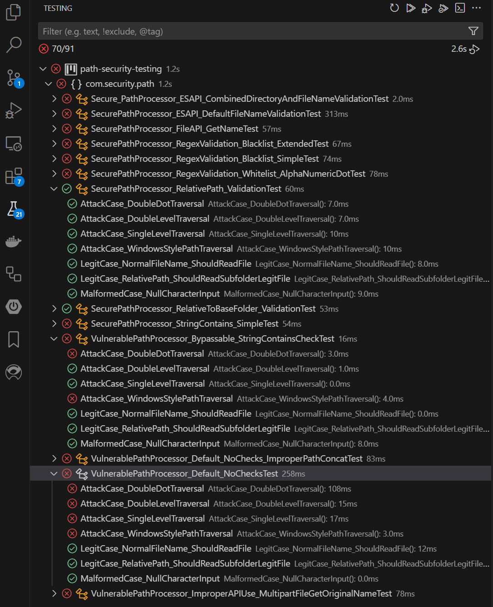

# Cheat Code series - v 0.0.1 - PoC for Path Traversal vulnerability

This project demonstrates secure and insecure implementations of path processing functions, focusing on path traversal vulnerabilities. It serves as an educational tool to understand common path traversal vulnerabilities and how to prevent them.

## Project Structure

### Core Components
- `src/main/java/com/security/path/PathProcessor.java`: Base abstract class defining the path processing interface
- `src/main/java/com/security/path/ReadFileResult.java`: Result wrapper class for file operations

### Secure Implementations
- `Secure_PathProcessor_ESAPI_CombinedDirectoryAndFileNameValidation.java`: ESAPI-based validation with combined directory and filename checks
- `SecurePathProcessor_ESAPI_DefaultFileNameValidation.java`: ESAPI-based filename validation
- `SecurePathProcessor_ESAPI_FileNameValidation.java`: Basic ESAPI filename validation
- `SecurePathProcessor_RelativeToBaseFolder_Validation.java`: Base folder-relative path validation
- `SecurePathProcessor_RegexValidation_Whitelist_AlphaNumericDot.java`: Whitelist-based regex validation
- `SecurePathProcessor_RegexValidation_Blacklist_Extended.java`: Extended blacklist-based regex validation
- `SecurePathProcessor_RegexValidation_Blacklist_Simple.java`: Simple blacklist-based regex validation
- `SecurePathProcessor_FileAPI_GetName.java`: File API-based validation
- `SecurePathProcessor_StringContains_Simple.java`: Simple string-based validation
- `SecurePathProcessor_RelativePath_Validation.java`: Relative path validation

### Vulnerable Implementations
- `VulnerablePathProcessor_Default_NoChecks.java`: No validation implementation
- `VulnerablePathProcessor_Default_NoChecks_ImproperPathConcat.java`: Unsafe path concatenation
- `VulnerablePathProcessor_ImproperAPIUse_MultipartFileGetOriginalName.java`: Unsafe multipart file handling
- `VulnerablePathProcessor_Bypassable_StringContainsCheck.java`: Bypassable string-based validation

### Test Components
- `BasePathProcessorTest.java`: Base test class with common test cases
- `PathTraversalTestPayloads.java`: Collection of path traversal test payloads
- `LegitimatePathsTestPayloads.java`: Collection of legitimate path test cases
- Individual test classes for each implementation

## Features

### Secure Implementation Examples
- ESAPI-based validation (directory and filename)
- Regex-based validation (whitelist and blacklist approaches)
- File API-based validation
- Relative path validation
- Base folder validation
- Input sanitization
- Null checks
- Exception handling

### Vulnerable Implementation Examples
- Direct path concatenation without validation
- Improper API usage
- Bypassable string-based checks
- Missing input validation
- Unsafe path resolution

## Running the Tests

To run the tests, use Maven:

```bash
mvn test
```
or VS test extention

## Dependencies

- Java 11 or higher
- JUnit 5
- Mockito (for testing)
- OWASP ESAPI (for secure implementations)

## License

This project is open source and available under the MIT License.

## How to Start

1. **Download the Project**: Clone the repository to your local machine.
   ```bash
   git clone https://github.com/Aleks-Ry/cheatcode/
   ```

2. **Launch the Unit-Test Tab**: Open the project in your preferred IDE and navigate to the unit-test tab to run the tests.

   

   In the screenshot above, you can see the results of the path security tests:
   - The **vulnerable implementation** failed to withstand some or all payloads.
   - The **secure implementation** successfully blocked all payloads while fully or partially maintaining the functionality of reading files.

3. **Run Tests**: You can also run the tests using Maven:
   ```bash
   mvn test
   ```
