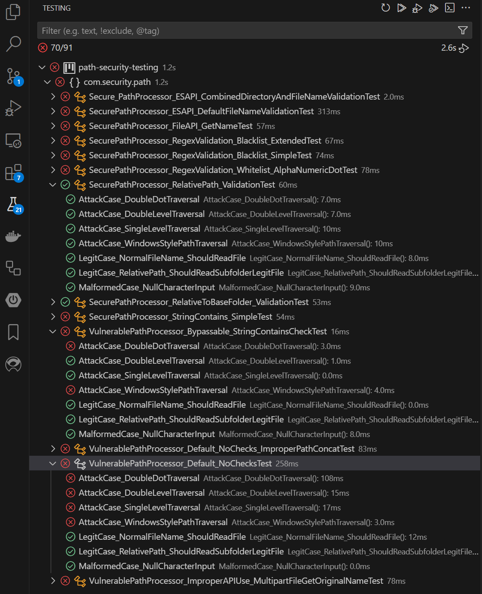

# OWASP Cheat Code Series — v0.0.1 — Path Traversal PoC

In an age of AI-generated code, it's more important than ever to confirm whether new code — or an AI-generated fix — is *truly* secure. Cheat Sheets and CWE tell you what to do; this project shows you what actually happens when you do it, by running the same attack payloads against a library of deliberately insecure and deliberately secure implementations of the same operation.

This first proof of concept covers **Path Traversal** in Java.

## How to read this project

**The test results are the report.** Every implementation is scored by the same seven test cases, and a failing test is a finding, not a defect to fix:

| Failing test | What it means |
| --- | --- |
| `AttackCase_*` fails on a **vulnerable** implementation | The payload got through — this is the vulnerability being demonstrated. Working as intended. |
| `AttackCase_*` fails on a **secure** implementation | The remediation does not hold. Worth fixing. |
| `LegitCase_*` / `EdgeLegitCase_*` fails | The remediation blocked the attack but broke legitimate functionality — the usability price of that fix. |

Surefire runs with `testFailureIgnore=true`, so `mvn test` completes successfully and prints the whole matrix instead of stopping at the first failure. **Do not "fix" the suite by relaxing the assertions in `BasePathProcessorTest` — that erases the report.**



## Quick start

```bash
git clone https://github.com/OWASP/www-project-cheat-code-series.git
cd www-project-cheat-code-series
mvn test
```

Then open the surefire output (`target/surefire-reports/`) or your IDE's test tab and read the matrix. Requires Java 11+ and Maven.

Useful variations:

```bash
mvn test -Dtest=SecurePathProcessor_FileAPI_GetNameTest     # one implementation
mvn test -Dtest='Vulnerable*Test'                           # all vulnerable implementations
mvn test -Dtest=SecurePathProcessor_FileAPI_GetNameTest#AttackCase_DoubleDotTraversal   # one payload

mvn exec:java -Dexec.mainClass=org.owasp.cheatcode.pathtraversal.Main   # console walkthrough, run from repo root
```

`Main` runs every processor against every payload over the committed [`secureStorage/`](secureStorage/) and [`pwnStorage/`](pwnStorage/) fixtures and prints `INJECTION SUCCEEDED` in red whenever a payload reaches the secret. The JUnit suite does the same thing against a `@TempDir` fixture, with assertions.

## Current results

98 tests, 22 failures. Recorded on Windows with Java 11 — results for the Windows-style payload in particular depend on the host OS, since `\` is only a separator on Windows.

| Implementation | `legit.txt` | `SomeSubFolder/sublegit.txt` | `../` | `../../` | `....//` | `..\..\ ` | `\0` |
| --- | :-: | :-: | :-: | :-: | :-: | :-: | :-: |
| **Vulnerable** | | | | | | | |
| `Default_NoChecks` | ✅ | ✅ | ❌¹ | ❌ | ❌¹ | ❌ | ✅ |
| `Default_NoChecks_ImproperPathConcat` | ✅ | ✅ | ❌¹ | ❌ | ❌¹ | ❌ | ✅ |
| `Bypassable_StringContainsCheck` | ✅ | ✅ | ✅ | ✅ | ❌ | ❌ | ✅ |
| `ImproperAPIUse_MultipartFileGetOriginalName` | ✅ | ✅ | ❌¹ | ❌ | ❌¹ | ❌ | ✅ |
| **Secure** | | | | | | | |
| `StringContains_Simple` | ✅ | ❌ | ✅ | ✅ | ✅ | ✅ | ✅ |
| `RegexValidation_Blacklist_Simple` | ✅ | ❌ | ✅ | ✅ | ✅ | ✅ | ✅ |
| `RegexValidation_Blacklist_Extended` | ✅ | ❌ | ✅ | ✅ | ✅ | ✅ | ✅ |
| `RegexValidation_Whitelist_AlphaNumericDot` | ✅ | ❌ | ✅ | ✅ | ✅ | ✅ | ✅ |
| `FileAPI_GetName` | ✅ | ❌ | ✅ | ✅ | ✅ | ✅ | ✅ |
| `ESAPI_FileNameValidation`² | ✅ | ❌ | ✅ | ✅ | ✅ | ✅ | ✅ |
| `ESAPI_DefaultFileNameValidation`² | ✅ | ❌ | ✅ | ✅ | ✅ | ✅ | ✅ |
| `ESAPI_CombinedDirectoryAndFileNameValidation` | ✅ | ❌ | ✅ | ✅ | ✅ | ✅ | ✅ |
| `RelativePath_Validation` | ✅ | ✅ | ✅ | ✅ | ✅ | ✅ | ✅ |
| `RelativeToBaseFolder_Validation` | ✅ | ✅ | ✅ | ✅ | ✅ | ✅ | ✅ |

¹ The payload was not *detected*, but it also did not reach the secret: in the fixture layout, `../` from the base directory lands one level short of `pwnStorage/`. The test fails on the detection assertion, not on data disclosure.

² Same verdicts, different route: `ESAPI_FileNameValidation` takes its allowed extensions from `ESAPI.properties`, so the policy is changed without recompiling; `ESAPI_DefaultFileNameValidation` hard-codes the list in Java. Watch the extension argument — `getValidFileName` rejects a null or empty list outright rather than treating it as "any extension", which silently disables sanitisation.

Two lessons the matrix makes concrete:

- **Blacklists partially work.** `Bypassable_StringContainsCheck` rejects `../` and stops the two obvious payloads, then falls to `....//` (which collapses back into `../` after naive stripping) and to `..\`.
- **Filename-only defences cost you subdirectories.** Every approach that reduces the input to a bare filename — `File.getName()`, the ESAPI filename validators, the regex validators — blocks all six attacks but can no longer serve `SomeSubFolder/sublegit.txt`. Only the two canonical-path approaches keep legitimate nested access *and* block every payload, which is why canonicalisation-and-containment is the recommendation rather than filtering.

## How the harness works

[`PathProcessor`](src/main/java/org/owasp/cheatcode/pathtraversal/PathProcessor.java) owns the whole flow — `readFile()` validates, optionally sanitises, joins to the base directory, and reads. An implementation supplies only:

- `isValidFilePath(input, errors)` — returning `false` means "traversal detected".
- `getSanitizedFilePath(input)` — the repair attempt, reached only when validation failed **and** `canSanitize` is `true`. Implementations that reject rather than repair set `canSanitize = false` in their constructor.
- `joinPaths(base, input)` — `protected` so a vulnerable variant can demonstrate unsafe concatenation.

Every outcome lands on [`ReadFileResult`](src/main/java/org/owasp/cheatcode/pathtraversal/ReadFileResult.java) (`isPathTraversalAttackDetected`, `isPathSanitized`, `fileReadResult`, `fileReadException`) so tests can observe a processor that silently succeeds at an attack, not just one that throws.

ESAPI-based implementations read their configuration from [`src/main/resources/esapi/`](src/main/resources/esapi/); changing `Validator.FileName` or `HttpUtilities.ApprovedUploadExtensions` changes their verdicts.

### Test fixture

[`BasePathProcessorTest`](src/test/java/org/owasp/cheatcode/pathtraversal/BasePathProcessorTest.java) builds this layout in a `@TempDir` before each test, which is why single-level traversal falls short of the secret and double-level reaches it:

```
tempDir/SecureStorage/baseWorkingDirectory/          <- base directory given to the processor
tempDir/SecureStorage/baseWorkingDirectory/legit.txt
tempDir/SecureStorage/baseWorkingDirectory/SomeSubFolder/sublegit.txt
tempDir/pwnStorage/secret.txt                        <- "Attack succeeded! CONFIDENTIAL DATA disclosed!"
```

## Contributing a new example

**A new implementation** — add the class to `src/main/java/.../pathtraversal/` following the `{Vulnerable|Secure}PathProcessor_{Technique}_{Variant}` naming convention, register it in `Main.createProcessors()`, and add a test class that extends `BasePathProcessorTest` and overrides only `createProcessor(baseDir)` and `getProcessorName()` (about ten lines). It is then scored against every payload automatically — never add test methods to an individual test class.

**A new attack payload** — add the constant to [`PathTraversalTestPayloads`](src/test/java/org/owasp/cheatcode/pathtraversal/PathTraversalTestPayloads.java) and a matching `@Test` in `BasePathProcessorTest`, so that every existing implementation is re-scored against it at once. Payload sources such as PayloadsAllTheThings are welcome.

Expect your addition to turn some rows red. That is the output.

See [CONTRIBUTING.md](CONTRIBUTING.md) for the OWASP-wide contribution process.

## Roadmap

* **Broader vulnerability coverage** — starting with XXE, Command Injection, and SQL Injection, aiming at the most common SAST-detectable vulnerabilities within the first year.
* **Enhanced test payloads** — more and more sophisticated payloads, to test the robustness of each fix.
* **Multi-language support** — additional languages and popular frameworks.

This is envisioned as a long-term, multi-year project; the timeline depends on available contributors and community support.

## Dependencies

Java 11+, JUnit 5, Mockito, Spring Web (for the multipart misuse example), and OWASP ESAPI 2.6.

## License

Licensed under the [Apache License 2.0](LICENSE).
